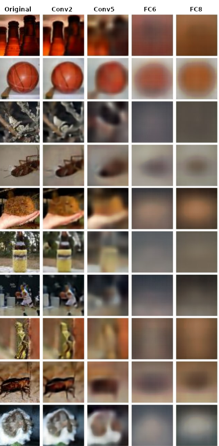
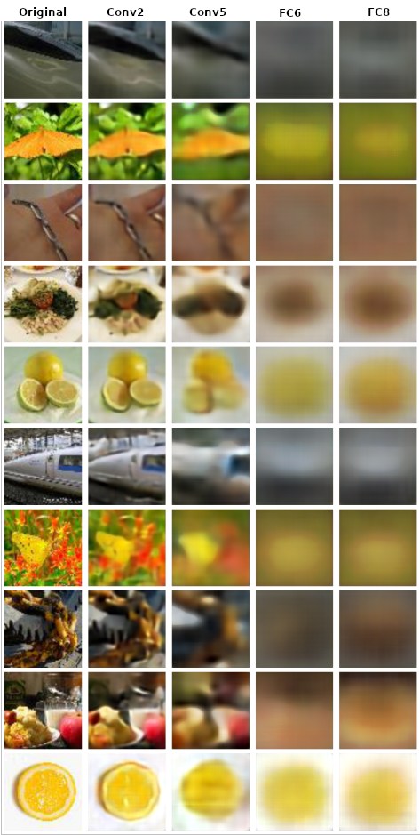

# Inverting Visual Representations

Inverting visual representations with convolutional networks is a fascinating topic in computer vision and deep learning. The goal of this task is to reconstruct an image from its feature representation, which is obtained from the layers of the pre-trained convolutional neural network (CNN) like AlexNet.

## 1.Model Architecture

The model used for this task usually consists of two parts: the encoder and the decoder. The encoder is a pre-trained CNN like AlexNet, which is used to extract features from the input image. The decoder, on the other hand, is responsible for inverting the feature vector back into an image. The decoder is usually a neural network that is trained to reconstruct the original image by minimizing the reconstruction error.

### Freezing the Encoder

We freeze the encoder network, like AlexNet, because we train it on a lot of training data, and the representation of its layers is almost rich. By doing so, we can use these rich feature representations to reconstruct the image without overfitting to the limited data available for the inversion task. Additionally, we can use different representations of the layers to analyze which features are important for the reconstruction task and gain insights into how the network processes visual information.

### Analyzing Feature Maps

Another interesting aspect of this application is that we can analyze which features are important for the reconstruction task by examining the feature maps at different layers of the encoder network. We can observe which features remain and which ones are removed as we move deeper into the network. This analysis can provide insights into how the network processes visual information and can help improve the inversion task.

## 2.Dataset

### Introduction

Tiny ImageNet is a subset of the original ImageNet dataset that contains 200 image classes, each with 500 training images and 50 validation images. The dataset is designed to be a more manageable benchmark for training machine learning models with limited computational resources.

### Image Size

One of the defining features of Tiny ImageNet is the reduced image size. While the original ImageNet dataset has images with a resolution of 224x224 pixels, the images in Tiny ImageNet are downsized to 64x64 pixels. This reduction in image size makes it easier to train machine learning models on the dataset using less powerful hardware.

## 3.Training and Validation

In this repository, 20 classes are randomly selected for training and validation. For each of these classes, 50 images are set aside for validation, and the remaining images are used for training

## 4.Parameters

The table presented below displays the parameters that were used during the model training process.

|           Parameter           |                  Value                   |
| :---------------------------: | :--------------------------------------: |
|        Normalize input        |        Mean = 0.5   Std = 0.5         |
|          Input Size           |                (227, 227)                |
|          Output size          |                (227, 227)                |
|          Batch size           |                    64                    |
| Percentage of validation data |                   10%                    |
|           Optimizer           |       Adam   betas = (0.9,0.99)       |
|         Loss function         |                   MSE                    |
|         Weight decay          |                  10e-5                   |
|            Nestrov            |                  False                   |
|      Activation function      |                LeakyReLu                 |
|         Learning rate         |                   1e-3                   |
|            Epochs             |                    30                    |
|           Schedular           | StepLR   Gamma = 0.5   Step size=4 |

## 5. Loss functions

## 6.Samples
The samples presented below are the output of a decoder network using different representations of an encoder network as input. As previously mentioned, we utilized AlexNet as the encoder network and specifically extracted Conv2, Conv5, FC6, and FC8 features, which can be observed in the samples below.

> ## Sample 1

> ## Sample 2

## 7. Conclusion
As we can see in the above samples, when we use extracted features from the final layers of the AlexNet model, the features are more fundamental and only retain important details. For instance, the reconstructed image from the Conv2 features in AlexNet contains more information than the reconstructed image from the FC8 features in AlexNet.

## 8.Refrence(s)
https://arxiv.org/pdf/1506.02753.pdf

